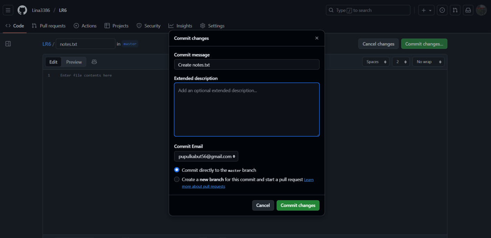
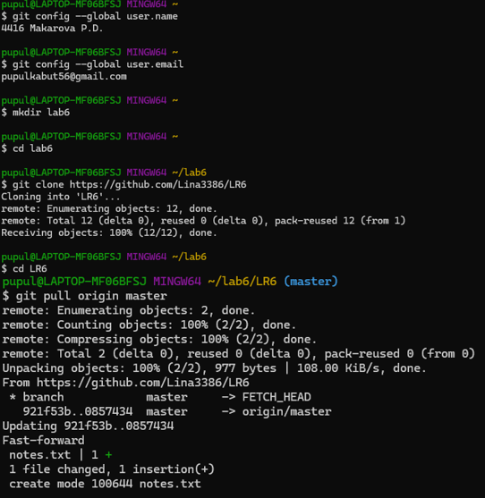
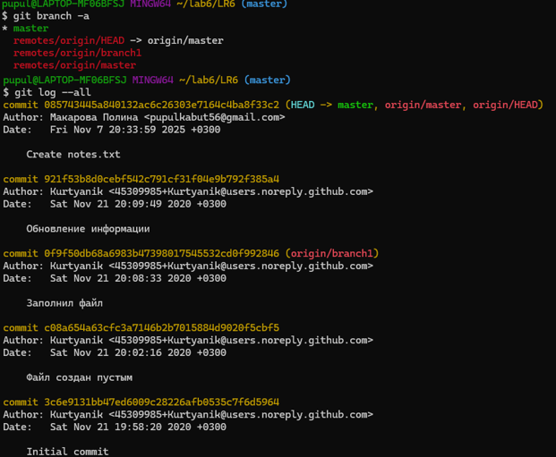
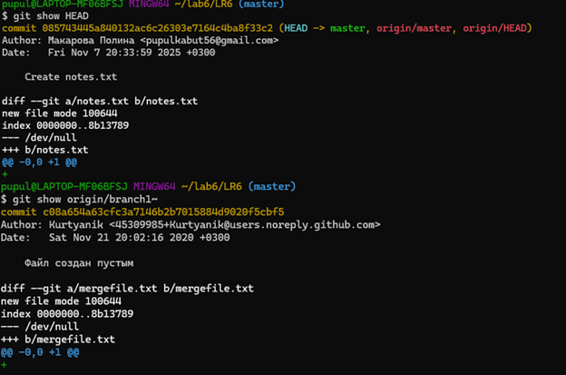
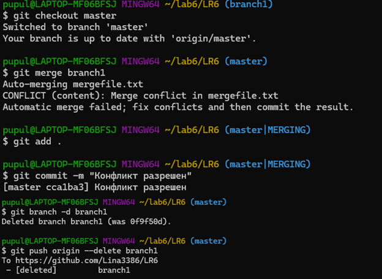
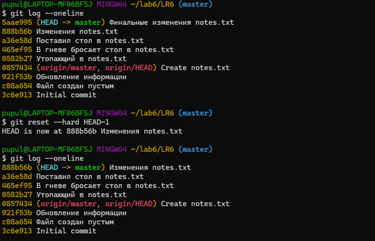

# Лабораторная работа №6: Система контроля версий

## Цель работы
Изучение базовых возможностей системы управления версиями, опыт работы с Git Api, 
опыт работы с локальным и удаленным репозиторием. 


## Задачи
1. Создать аккаунт на GitHub
2. Fork репозитория https://github.com/Kurtyanik/LR6/
3. Установить и настроить Git
4. Клонировать репозиторий
5. Работа с ветками и слиянием
6. Откат коммита
7. Оформление отчета


## Выполнение работы

### 1. Создание и настройка аккаунта
- Создан аккаунт на GitHub: Lina3386
- Выполнен форк репозитория: https://github.com/Kurtyanik/LR6/
- Установлен git version 2.47.0.windows.1
- Настроены параметры пользователя:
    - Имя: "4416 Makarova P.D."
    - Почта: "pupulkabut56@gmail.com"


### 2. Работа с репозиторием
Снимки выполненных операций:

#### Скриншот 1: Создание файла через интерфейс GitHub


#### Скриншот 2: Команды Git в консоли


#### Скриншот 3: История коммитов


#### Скриншот 4: Последние изменения веток


#### Скриншот 5: Слияние веток

1. Новая ветка + master (без конфликта):


2. Ветка branch1 + master (с конфликтом):


Для решения конфликта 2 текста разных версий файла mergefile.txt были объединёны, дублирующиеся слова были удалены. 

#### Скриншот 6: Откат коммита



## Лог команд

```
git config --global user.name "4416 Makarova P.D."
git config --global user.email
git clone https://github.com/Lina3386/LR6
git status
git pull origin master
git branch -a
git log --oneline
git log
git log --all
git show HEAD
git show origin/branch1~
git checkout -b new_branch
git add notes.txt
git commit -m "Добавлен текст в notes.txt"
git checkout master
git merge new_branch
git branch -d new_branch
$ git push origin --delete branch1
git branch
git reset --hard HEAD~1
git checkout -b report
git log --pretty=format:"%h %ad %an %s" --date=short
```

## История коммитов

| Хэш | Дата | Автор | Комментарий |
|-----|------|-------|-------------|
| 1a886b6 | 2025-11-08 | 4416 Makarova P.D. | Добавлены скриншоты |
| f10f0b9 | 2025-11-07 | 4416 Makarova P.D. | Выполненные операции и лог команд |
| 9e956d3 | 2025-11-07 | 4416 Makarova P.D. | Начало оформления отчета: цель работы и задачи |
| 888b56b | 2025-11-07 | 4416 Makarova P.D. | Изменения notes.txt |
| a36e58d | 2025-11-07 | 4416 Makarova P.D. | Поставил стол в notes.txt |
| 465ef95 | 2025-11-07 | 4416 Makarova P.D. | В гневе бросает стол в notes.txt |
| 0582b27 | 2025-11-07 | 4416 Makarova P.D. | Утопающий в notes.txt|
| cca1ba3 | 2025-11-08 | 4416 Makarova P.D. | Конфликт разрешен |
| 0857434 | 2025-11-07 | Макарова Полина | Create notes.txt |
| 921f53b | 2020-11-21 | Kurtyanik | Обновление информации |
| c08a654 | 2020-11-21 | Kurtyanik | Файл создан пустым |
| 3c6e913 | 2020-11-21 | Kurtyanik | Initial commit |

## Вывод
В результате выполнения лабораторной работы были изучены базовые возможности системы управления версиями, опыт работы с Git Api, опыт работы с локальным и удаленным репозиторием. 
